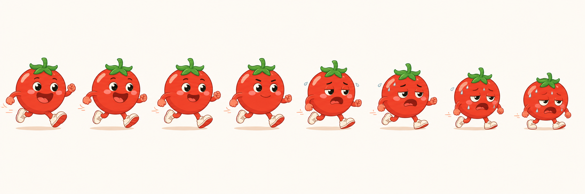

# 番茄钟 · Pomodoro Timer

A macOS Pomodoro timer with an animated running tomato character.



## Features

- Native macOS app (Swift / AppKit) — no Electron, no Python runtime needed at launch
- Animated tomato sprite that runs during focus sessions and fills green as time passes
- Focus / short break / long break modes with auto-advance
- Configurable durations via in-app settings
- macOS notifications on session completion
- Also ships a Python CLI and a Python tkinter GUI (no extra dependencies beyond Pillow for the build step)

## Requirements

| Component | Requirement |
|-----------|-------------|
| macOS native app | macOS 12+, Xcode command-line tools (`swiftc`) |
| Sprite / icon processing | Python 3.10+, Pillow (`pip install pillow`) |
| Python CLI / GUI | Python 3.10+, no extra packages |

## Build

```bash
# Install Python dependency (one-time)
pip install pillow

# Build the .app
./build_mac_app.sh
# → output/番茄钟.app
```

Open `output/番茄钟.app` to run it.

## Project Structure

```
pomodoro-mac/
├── src/
│   └── PomodoroNative.swift      # Native macOS app (AppKit + UserNotifications)
├── scripts/
│   ├── prepare_tomato_sprite.py  # Splits sprite sheet → frames, GIF, logo, .icns
│   └── GenerateTomatoIcon.swift  # Alternate icon generator
├── assets/
│   └── tomato-run-sequence.png   # 8-frame running tomato sprite sheet
├── pomodoro.py                   # Terminal Pomodoro timer (CLI)
├── pomodoro_design.py            # Shared design constants and helpers
├── pomodoro_gui.py               # Tkinter GUI timer
├── test_pomodoro.py              # Unit tests
└── build_mac_app.sh              # One-step build script
```

## Python CLI Usage

```bash
# Run 4 × 25-minute sessions with 5-minute breaks
python3 pomodoro.py

# Custom schedule
python3 pomodoro.py -w 50 -s 10 -l 30 -n 6

# Preview schedule without waiting
python3 pomodoro.py --dry-run
```

## Python GUI

```bash
python3 pomodoro_gui.py
```

## Tests

```bash
python3 -m pytest test_pomodoro.py -v
# or
python3 -m unittest test_pomodoro
```

## How the Animation Works

`assets/tomato-run-sequence.png` is an 8-frame horizontal sprite sheet.
`scripts/prepare_tomato_sprite.py` slices it into individual frames, removes the background, generates a green-tinted variant (used as the timer fill), creates a preview GIF, and packages everything into an `.icns` app icon.

At runtime the Swift app renders the red and green variants using a clip mask: as the session progresses, more of the green frame is revealed from the bottom up.

## License

MIT
